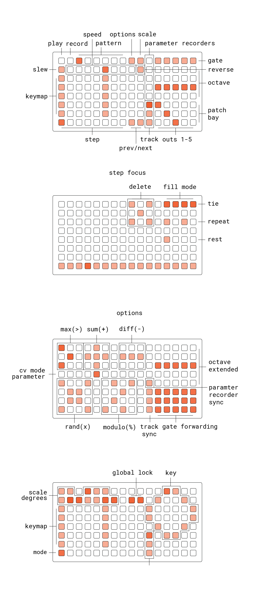

# brds

3 sequencers, 2 function generators, 3 shift registers, 5 destinations

# documentation

- **E1-E3:** envelope time, slope, shape
- **K2:** evelope focus
- **K3:** envelope loop
- **K1:** alt

## grid

## ++

gate summing modes (should it be global or per-output ?)
- or/and/xor -> not

cv mixing (global)
- max (>)
- sum (+)
- diff (-)
- min (<)
- random (x) (w/ possible probablility parameter)

pattern start/length quantization (sync mode)
- quantize to selected multiple of a bar. setting quant to 1+ will turn brds into a syncronous instrument
- is smart about rounding down, so if the pattern ends late and there is no or very little information in the pattern, it will truncate down rather than up

consider splitting alt into separate mix & scale pages, for more UI space
- display truth tables or glyphs on grid for each mix mode 

consider playhead control in place of top/bottom keybaord row
- mlr style, with cuts & sublooping
- in synced mode, this would be synced to beats/bars (depending on pattern length)

## +?

arpegiator
- in syncronous modes, this would offer some nice quantized stuff to contrast the more freeform layers

op-z style non-realtime sequencing (based around play & paused states)
