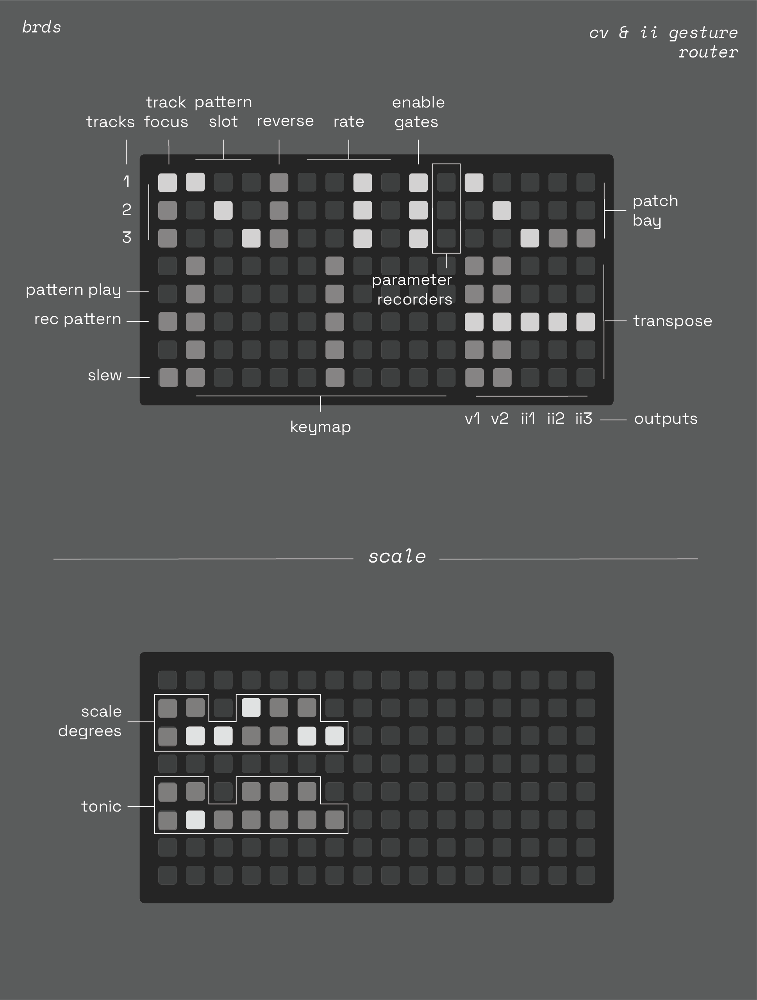

# brds (WIP)

cv & ii gesture router

3-track grid keyboard with pattern memory & slew routed into a 5-output patch bay & shift register with muti-mode CV mixing. each output addresses either a crow voltage + function generator or an ii destination.

## hardware

**required**

- [norns](https://github.com/p3r7/awesome-monome-norns) (220321 or later)
- [grid](https://monome.org/docs/grid/) (128 only)
- [crow](https://monome.org/docs/crow/)

**also supported**

- [just](https://www.whimsicalraps.com/products/just-friends?variant=5586981781533) [friends](https://github.com/whimsicalraps/Just-Friends/blob/main/Just-Type.md)
- second crow (over ii)

## install

~ not done yet ~

## documentation

### norns

- **E1:** page focus
- pages:
  - function 1 & 2
     - **K2:** shape
    - **K3:** trns/sus/cyc
    - **E2:** time
    - **E3:** ramp
  - jf
    - **K2:** synth mode
    - **K3:** GOD
    - **E2:** note level
    - **E3:** run
  - mix mode
    - **E2:** mode x
    - **E3:** mode y
- **K1 (hold):** scale

### grid

## notes

cv mixing 
- mix x & y coordinites, then map to scale
- independently assign modes for x & y axes
- mixed keymaps (1-5) are displayed on screen
- modes
  - top (track)
  - bottom (track)
  - max
  - sum
  - diff
  - min

crow input destiations
- function 1 & 2 gate in
- output 1-5 transpose (oct or scale degree)
- jf pitch bend

output destinations
- crow cv + func 1+2
- crow cv + func 2+3
- ii jf 1-6
- ii crow cv + gate 1+2
- ii crow cv + gate 3+4

memory modes: shared, unique

patterns: sync leader
- options: 1, 2, 3, clock
- how to incorporate in UI?
  - under K1 alt menu
  
idea: voice allocation rather than shift registers (true polphony w/ voice stealing)
- this would be harder / also different results than shift registers
- implimentation
  - pattern recording works via the momentary component state, and then those deltas feed the voice allocator.
  - free voice buffer: last in, first out
  - voice stealing buffer: first in, first out
  - when env is not in sustain mode, voice is only allocated for a half second or so (just to blink on the grid)
